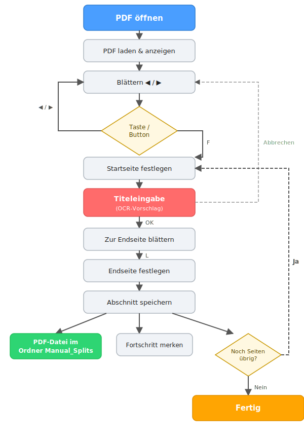

# PDFTrenner Swift — Benutzerdokumentation

## Übersicht

PDFTrenner ist eine Anwendung zum interaktiven Durchblättern und Aufteilen von PDF-Dateien. Die Swift-Variante läuft nativ auf macOS (ab Monterey 12.0) als Universal Binary (ARM + Intel).

## Installation

### Variante A: DMG (empfohlen)

1. `PDFTrennerSwift-1.0-universal.dmg` öffnen
2. `PDFTrenner.app` in den Ordner `Programme` ziehen
3. Beim ersten Start: Rechtsklick → `Öffnen` (macOS-Gatekeeper-Bestätigung)

### Variante B: Aus dem Quellcode

```bash
cd PDFTrennerSwift
swift build -c release          # aktuelle Architektur
# oder:
./build_dmg.sh                  # Universal Binary + DMG erstellen
```

Voraussetzung: macOS 12+, Xcode Command Line Tools.

## Start

Beim Start erscheint ein Dateiauswahl-Dialog. Gewünschte PDF-Datei auswählen.

Wenn die Anwendung mit einem Dateipfad als Argument gestartet wird, wird diese Datei direkt geladen:

```bash
open PDFTrenner.app --args /Pfad/zur/Datei.pdf
```

## Benutzeroberfläche

### Hauptfenster

| Element | Beschreibung |
|---------|-------------|
| **PDF-Ansicht** | Zeigt die aktuelle Seite des Dokuments an |
| **Statusleiste** | Zeigt: Seitennummer, Startseite, aktueller Titel |
| **◀ / ▶** | Vorherige/nächste Seite |
| **Start (F)** | Startseite festlegen und Titeleingabe öffnen |
| **Ende (L)** | Endseite festlegen und Speichern auslösen |

### Titeleingabe

Wird automatisch geöffnet, wenn die Startseite gesetzt wird (Taste `F`). Das Eingabefeld erscheint als schwebendes Panel rechts neben dem Hauptfenster.

- Der erkannte Titel wird automatisch vorausgefüllt
- Beliebigen Titel eintippen oder den Vorschlag übernehmen
- **OK** oder **Enter** → Titel übernehmen und fortfahren
- **Abbrechen** oder **Esc** → Titel leeren

### Workflow



**F** = Startseite setzen → Titeleingabe  
**L** = Endseite setzen → sofort speichern

Nach dem Speichern wird automatisch die nächste Seite als neue Startseite vorgeschlagen und die Titeleingabe geöffnet. So kann ein komplettes PDF in einem Durchlauf aufgeteilt werden.

## Zustandsspeicherung

Beim Beenden wird der Fortschritt neben der PDF-Datei gespeichert. Beim nächsten Öffnen der gleichen Datei wird automatisch an der letzten Position fortgefahren. Der Titel wird **nicht** gespeichert — nur die Seitenposition.

## Ausgabedateien

Die extrahierten Abschnitte werden im Unterordner `Manual_Splits` neben der Original-PDF gespeichert:

```
/Pfad/zur/
├── Liedermappe.pdf
└── Manual_Splits/
    ├── Amazing Grace.pdf
    ├── Ich sing dir ein Lied.pdf
    └── ...
```

### Dateinamen

Der eingegebene Titel wird als Dateiname verwendet. Umlaute werden dabei umgewandelt:

| Eingabe | Dateiname |
|---------|-----------|
| `Über den Wolken` | `Ueber den Wolken.pdf` |
| `Ännchen` | `Aennchen.pdf` |
| `Möhre` | `Moehre.pdf` |
| `Große Liebe` | `Grosse Liebe.pdf` |

Sonderzeichen, die keine Buchstaben/Zahlen sind, werden entfernt. Wenn der Titel nach der Bereinigung leer ist, wird `Song_Seite_N` verwendet.

## Tastaturkürzel

| Taste | Aktion |
|-------|--------|
| `←` | Vorherige Seite |
| `→` | Nächste Seite |
| `F` | Startseite setzen + Titeleingabe |
| `L` | Endseite setzen + Speichern |
| `Enter` | Titel bestätigen (im Eingabefeld) |
| `Esc` | Titeleingabe abbrechen |

## Titelerkennung (OCR)

Die Anwendung erkennt Titel automatisch aus der oberen 10% der Startseite.

- Erkennung in Deutsch und Englisch
- Keine externe Software nötig
- Ergebnis wird automatisch ins Titelfeld eingetragen, kann aber jederzeit manuell korrigiert werden

## Fehlermeldungen

- **Datei nicht gefunden** — Der angegebene Pfad ist ungültig
- **PDF konnte nicht geladen werden** — Die Datei ist kein gültiges PDF
- **Keine Datei ausgewählt** — Der Dateiauswahl-Dialog wurde abgebrochen
- **Endseite vor Startseite** — `L` wurde gedrückt, bevor eine Startseite gesetzt wurde
- **Letzte Seite erreicht** — Das Ende des Dokuments wurde erreicht

## Beenden

Die Anwendung beendet sich automatisch, wenn das Hauptfenster geschlossen wird.